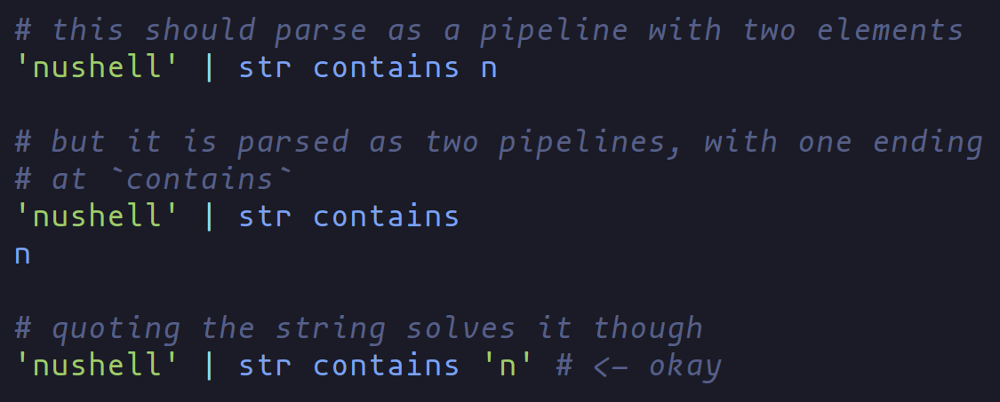
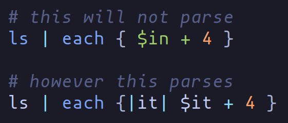
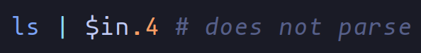

# tree-sitter nu

[**WIP**] [nushell](https://github.com/nushell/nushell) grammar for [tree-sitter](https://tree-sitter.github.io/tree-sitter/)

# issues
1. unquoted strings

2. blocks vs records
since we cannot backtrack, it is difficult to tell apart blocks and
records. so currently, blocks are not parsed as values

3. command arguments are parsed as strings

here `2`, `-f`, `arg` will all be parsed as strings

## installation guide
- for *neovim* users, please have a look at [`installation/neovim.md`](installation/neovim.md)

# tree-sitter-nu

This is an experiment to see if we can create a good parser for nu-lang.

## Goals (brainstorming)

- Ability to serve as a parser for a repl
- Ability to work in editors that support tree-sitter (`hx`, `nvim`, others)
- Ability to work in rust
- Fast
- Ability to be utilized for syntax highlighting
- ?

## How-To - taken from [here](https://tree-sitter.github.io/tree-sitter/creating-parsers)

1. `cargo install tree-sitter-cli`
2. make sure nodejs and npm is installed (you may have to do npm install - see docs above)
3. `tree-sitter generate`
4. `tree-sitter parse example-file.nu`

## Examples with rust

1. main.rs
2. `cargo run --example main`

## Testing

1. Add a file to test/corpus/descriptive_test_name.txt
2. Use the `custom_command_1.txt` as a guide
3. run `tree-sitter test -f 'custom command 1'` and evaluate the results
4. More information can be found [here](https://tree-sitter.github.io/tree-sitter/creating-parsers#command-test)

## Tips

- A line in the grammar.js that begins with `$._blah` means that `blah` is anonymous and won't show up in the final syntax tree.
- Most of the grammar how-to is found [here](https://tree-sitter.github.io/tree-sitter/creating-parsers#the-grammar-dsl)

## Further reading

- https://siraben.dev/2022/03/22/tree-sitter-linter.html
- https://derek.stride.host/posts/comprehensive-introduction-to-tree-sitter

- https://tree-sitter.github.io/tree-sitter/
- https://rfdonnelly.github.io/posts/using-tree-sitter-parsers-in-rust/
- https://deepsource.io/blog/lightweight-linting/
- https://github.com/tree-sitter/tree-sitter/issues/418
- https://github.com/DerekStride/tree-sitter-math
